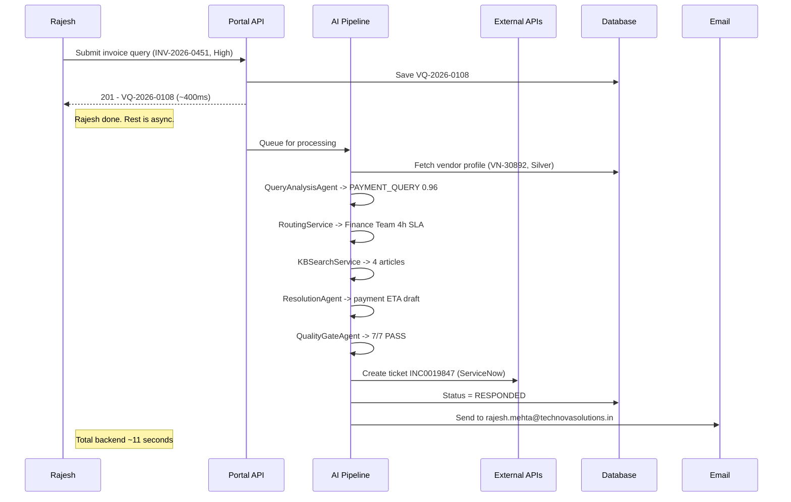
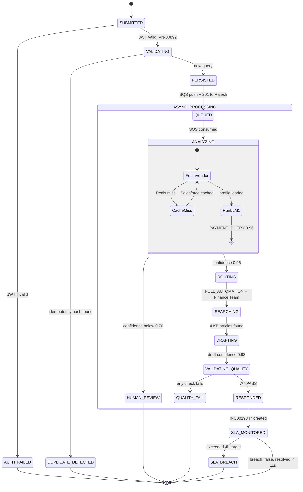
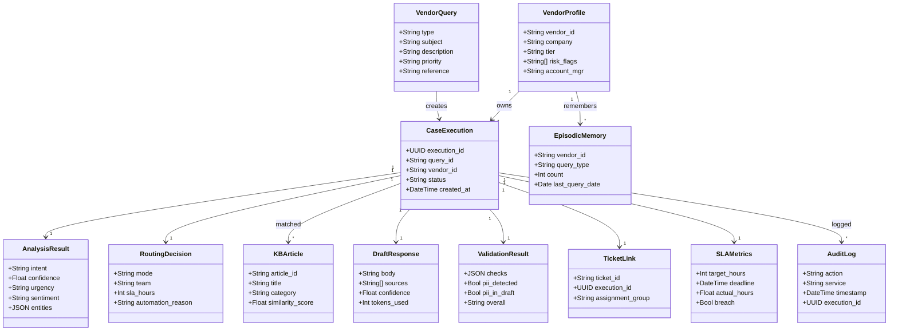

# VQMS query diagrams: six views of one query

Same query, six angles. Everything here traces Rajesh Mehta's invoice
payment inquiry (VQ-2026-0108) through the VQMS pipeline. If you want
the full payloads and JSON, read VQMS_Real_Query_Flow.md. This document
is the pictures.

---

## 1. Flowchart

Two versions. 1A shows the happy path as a straight line with decision
diamonds branching off. 1B zooms into each decision with the actual
data and both outcomes.

### 1A. High-level flow

```
  [Rajesh submits invoice query]
              |
              v
        /JWT valid?/---no---> [401 Unauthorized]
              |
             yes
              |
              v
     [Query API: validate payload]
              |
              v
       /Duplicate?/---yes---> [Return existing VQ-2026-0108]
              |
              no
              |
              v
     [Generate VQ-2026-0108]
     [INSERT case_execution]
     [Publish QueryReceived]
     [Push to SQS]
              |
              v
     [201 -> Rajesh]              <--- ~400ms, Rajesh is done
     ============= ASYNC BOUNDARY =============
              |
              v
     [LangGraph: consume from SQS]
              |
              v
       /Cache hit?/---miss---> [Salesforce: fetch VN-30892]
              |                        |
             hit                       v
              |<------[SET vqms:vendor:VN-30892, Silver, 1h TTL]
              |
              v
     [QueryAnalysisAgent (LLM #1)]
     [PAYMENT_QUERY, confidence 0.96]
              |
              v
         /Route?/---HUMAN_REVIEW---> [Escalation queue]
              |
        FULL_AUTOMATION
              |
              v
     [RoutingService + KBSearchService]  (parallel)
     [Finance Team, 4h SLA | 4 articles]
              |
              v
     [ResolutionAgent (LLM #2)]
     [April 5 processing, April 10 credit]
              |
              v
      /Quality OK?/---FAIL---> [Human review queue]
              |
           7/7 PASS
              |
              v
     [Ticket INC0019847 -> ServiceNow]
     [Email -> rajesh.mehta@technovasolutions.in]
     [Status: RESPONDED]
              |
              v
     [SLA Monitor: 4h timer, breach=false]
```

### 1B. Decision detail

Each diamond from 1A, with the actual check and both outcomes.

```
DECISION 1: JWT VALIDATION
  Input:   Authorization: Bearer <jwt-token>
  Check:   Cognito validates signature + expiry
           Extracts: vendor_id=VN-30892, role=VENDOR
  YES  ->  Forward to Query API with enriched claims
  NO   ->  HTTP 401, body: {"error":"token_expired"}

DECISION 2: DUPLICATE CHECK
  Input:   sha256("Payment Status Inquiry..." + description + "VN-30892")
  Check:   GET vqms:idempotency:<hash>
  FOUND -> Return existing VQ-2026-0108 (HTTP 200, not 201)
  MISS  -> Continue, SET key with 7d TTL

DECISION 3: VENDOR CACHE
  Input:   GET vqms:vendor:VN-30892
  Check:   Redis key exists and TTL > 0?
  HIT   -> Use cached profile
  MISS  -> Salesforce Account API query
           Response: tier=SILVER, risk=[OVERDUE_INVOICE_HISTORY],
                     account_mgr=Anil Kapoor
           SET vqms:vendor:VN-30892 with 1h TTL

DECISION 4: INTENT CLASSIFICATION
  Input:   Rajesh's description + subject + type="invoice"
  Check:   QueryAnalysisAgent (Bedrock Claude Sonnet)
  Output:  intent=PAYMENT_QUERY (not INVOICE_DISPUTE)
           confidence=0.96, urgency=HIGH (16 days overdue)
  If confidence < 0.70 -> flag for human review
  Rajesh's case: 0.96 -> proceed to automation

DECISION 5: ROUTING MODE
  Input:   intent, confidence, vendor tier, risk flags
  Check:   RoutingService rules engine (no LLM)
  Rules:   confidence >= 0.85 AND intent in automatable set
           AND no BLOCK_AUTOMATION flag
  Result:  FULL_AUTOMATION (OVERDUE_INVOICE_HISTORY is a warning
           flag, not a blocking flag)
  Alt:     If HUMAN_REVIEW -> push to human queue, 8h SLA

DECISION 6: QUALITY GATE
  Input:   Draft response from ResolutionAgent
  Checks:  6 deterministic + 1 PII scan
           - response_length: 847 chars           PASS
           - contains_greeting: true               PASS
           - contains_ticket_ref: INC0019847       PASS
           - confidence_above_threshold: 0.93      PASS
           - no_prohibited_phrases: true           PASS
           - sources_cited: KB#1203, KB#891        PASS
           - PII scan: phone in QUERY, not DRAFT   PASS
  Overall: 7/7 PASS
  Alt:     Any FAIL -> human review queue
```

---

## 2. Sequence diagram

Two Mermaid versions. 2A has all 16 services. 2B squashes them into
6 logical groups -- use that one in slide decks.

### 2A. Full sequence (16 participants)

```mermaid
sequenceDiagram
    participant R as Rajesh
    participant GW as API Gateway
    participant QA as Query API
    participant RD as Redis
    participant PG as PostgreSQL
    participant S3 as S3
    participant SQ as SQS
    participant EB as EventBridge
    participant LG as LangGraph
    participant BK as Bedrock
    participant SF as Salesforce
    participant PV as pgvector
    participant CM as Comprehend
    participant SN as ServiceNow
    participant MG as MS Graph
    participant SL as SLA Monitor

    R->>GW: POST /queries (JWT + invoice payload)
    GW->>GW: Cognito validates JWT, extracts VN-30892
    GW->>QA: Enriched request (vendor_id=VN-30892)
    QA->>RD: GET vqms:idempotency:sha256
    RD-->>QA: NOT FOUND
    QA->>PG: INSERT case_execution (VQ-2026-0108)
    QA->>RD: SET idempotency key EX 604800
    QA->>EB: Publish QueryReceived
    QA->>SQ: Push to vqms-query-intake-queue
    QA-->>R: 201 query_id VQ-2026-0108
    note right of R: ~400ms. Rajesh is done waiting.

    rect rgb(40, 40, 60)
        note over SQ,SL: ASYNC -- everything below runs in background
        SQ->>LG: Consume message
        LG->>PG: UPDATE status=ANALYZING
        LG->>RD: SET vqms:workflow:b2c4d6e8
        LG->>RD: GET vqms:vendor:VN-30892
        RD-->>LG: CACHE MISS
        LG->>SF: GET Account VN-30892
        SF-->>LG: tier=SILVER risk=OVERDUE_INVOICE_HISTORY
        LG->>RD: SET vqms:vendor:VN-30892 EX 3600
        LG->>PG: SELECT episodic_memory (3 prior queries)

        LG->>BK: QueryAnalysisAgent prompt (Claude Sonnet)
        BK-->>LG: intent=PAYMENT_QUERY confidence=0.96 urgency=HIGH
        LG->>S3: PUT prompts/b2c4d6e8/query-analysis.json
        LG->>PG: UPDATE case_execution with analysis
        LG->>EB: Publish AnalysisCompleted

        par RoutingService + KBSearchService
            LG->>LG: Rules engine -> FULL_AUTOMATION Finance Team 4h
            LG->>PG: INSERT routing_decision
        and
            LG->>BK: Titan embed query text
            BK-->>LG: vector 1536 dims
            LG->>PV: cosine similarity search (invoice_payment)
            PV-->>LG: 4 articles (96% 89% 82% 71%)
        end

        LG->>BK: ResolutionAgent prompt (Claude Sonnet)
        BK-->>LG: Draft (April 5 processing, April 10 credit)
        LG->>S3: PUT prompts/b2c4d6e8/resolution.json
        LG->>PG: UPDATE case_execution with draft
        LG->>EB: Publish DraftPrepared

        LG->>CM: DetectPiiEntities on draft
        CM-->>LG: No PII in draft
        LG->>S3: PUT audit/INC0019847/validation-report.json
        LG->>PG: INSERT validation_results (7/7 PASS)
        LG->>EB: Publish ValidationPassed

        LG->>SN: POST /api/now/table/incident
        SN-->>LG: INC0019847
        LG->>PG: INSERT ticket_link
        LG->>RD: SET vqms:ticket:xyz789abc012
        LG->>MG: sendMail to rajesh.mehta@technovasolutions.in
        LG->>PG: UPDATE status=RESPONDED
        LG->>EB: Publish TicketCreated + EmailSent + QueryResolved

        EB->>SL: TicketCreated event
        SL->>RD: SET vqms:sla:xyz789abc012 (4h deadline)
        SL->>PG: INSERT sla_metrics (breach=false)
    end
```



### 2B. Simplified sequence (6 participants)



---

## 3. State diagram

The query's status as it moves through the pipeline. 3A is ASCII with
every state including error branches. 3B is the same thing in Mermaid.

### 3A. ASCII state machine

```
                         [*] START
                            |
                            v
                      +-----------+     JWT invalid
                      | SUBMITTED |--------------------> [AUTH_FAILED]
                      +-----------+                      (terminal, 401)
                            |
                          valid
                            |
                            v
                      +------------+    hash found
                      | VALIDATING |-------------------> [DUPLICATE_DETECTED]
                      +------------+                     return existing ID
                            |                            (terminal)
                         new query
                            |
                            v
                      +-----------+
                      | PERSISTED |  VQ-2026-0108 assigned
                      +-----------+  case_execution row created
                            |
                            v
                      +--------+
                      | QUEUED |   SQS push, 201 to Rajesh
                      +--------+
                            |
                      ====ASYNC====
                            |
                            v
                      +-----------+    cache miss
                      | ANALYZING |. . . . . . . . > (CACHE_MISS)
                      +-----------+                   Salesforce round-trip
                       |    ^                         then rejoin
                       |    '. . . . . . . . . . . .'
                       |
                       | LLM #1 complete
                       v
                      +---------+     confidence < 0.70
                      | ROUTING |---------------------> [HUMAN_REVIEW]
                      +---------+                       (human queue, 8h SLA)
                            |
                      FULL_AUTOMATION
                            |
                            v
                      +-----------+
                      | SEARCHING |  4 KB articles matched
                      +-----------+
                            |
                            v
                      +----------+
                      | DRAFTING |   LLM #2, confidence 0.93
                      +----------+
                            |
                            v
                      +--------------------+    any check FAIL
                      | VALIDATING_QUALITY |----------------> [QUALITY_FAIL]
                      +--------------------+                  (human review)
                            |
                          7/7 PASS
                            |
                            v
                      +-----------+
                      | RESPONDED |  INC0019847 created, email sent
                      +-----------+
                            |
                            v
                      +---------------+    actual > target
                      | SLA_MONITORED |-------------------> [SLA_BREACH]
                      +---------------+                     (escalation)
                            |
                        breach=false
                            |
                            v
                         [*] END
```

### 3B. Mermaid state diagram



---

## 4. Mind map

Three branches off the root. Left is what went in, middle is what
the system did, right is what came out.

```
                                  VQ-2026-0108
                             Rajesh Mehta's Query
                            /         |         \
                           /          |          \
                    QUERY DATA      SYSTEM       OUTCOME
                    /   |   \      /   |   \      /   |   \
                   /    |    \    /    |    \    /    |    \
                WHO   WHAT  CLASS SYNC ASYNC STORES RESOL  DLVRY  COST
                 |     |     |     |    |     |      |      |      |
              Rajesh  INV-  PAYMNT APIGw Orch PG:12  Apr 5  INC0   $0.033
              Mehta   2026- _QUERY  +   +5    Rds:9  proc   0198   ~11s
                |     0451   |    Query agts  S3:3    |     47      |
             TechNova  |   HIGH   API   |    EB:7   Apr 10  Fin   2xClaude
             Solns.    |     |   ~400ms |    SQS:1  credit  Team  1xTitan
                |    Rs.4,75 |         |     BK:3    |       |    ~5800
             VN-30892  000  POLITE_  Services CM:1  exped.  email  tokens
                |      |   CONCRND    |      SF:1   pymnt  rajesh
             Silver  PO-HEX  |     1. APIGw  SN:1   offer  @tech
             tier    78412  0.96   2. QueryAPI MG:1   |    nova.in
                |      |   conf   3. Orchstr        KB     portal
             OVERDUE  16d         4. Analysis      #1203   update
             _INVOICE ovrd        5. Routing       #891
             _HISTORY             6. KBSearch
                |                 7. Resolution
             Anil Kapoor         8. QualityGate
             (acct mgr)         9. TicketOps
                                10. SLAMonitor
```

---

## 5. Network topology

Where each service actually runs and how traffic crosses zone boundaries.

```
+============================================================================+
|  ZONE 1: PUBLIC INTERNET                                                   |
|                                                                            |
|  [Rajesh's Browser]                                                        |
|  rajesh.mehta@technovasolutions.in                                         |
|       |                                                                    |
|       | HTTPS (TLS 1.3)                                                    |
+============================================================================+
        |
        v
+============================================================================+
|  ZONE 2: VPC PUBLIC SUBNET (ap-south-1)                                    |
|                                                                            |
|  [CloudFront CDN] ---> [API Gateway]                                       |
|                             |                                              |
|                        [Cognito Authorizer]                                |
|                        JWT validation                                      |
|                        vendor_id=VN-30892                                  |
|                        role=VENDOR                                         |
|                             |                                              |
|                        VPC Link                                            |
+============================================================================+
        |
        v
+============================================================================+
|  ZONE 3: VPC PRIVATE SUBNET (no internet gateway)                          |
|                                                                            |
|  +------------------+    +--------------------+    +-------------------+   |
|  | Query API        |    | LangGraph          |    | Agent Lambdas     |   |
|  | (Lambda)         |    | Orchestrator       |    |                   |   |
|  |                  |    | (ECS Fargate)      |    | QueryAnalysis     |   |
|  | Validates input  |    |                    |    | Resolution        |   |
|  | Generates IDs    |    | Consumes SQS       |    | QualityGate       |   |
|  | Returns 201      |    | Runs agent graph   |    | (RoutingService   |   |
|  +--------+---------+    +---------+----------+    |  + KBSearchService |   |
|           |                        |               |  are in-process)  |   |
|           |   VPC Endpoints        |   IAM Auth    +-------------------+   |
+============================================================================+
            |                        |                       |
            v                        v                       v
+============================================================================+
|  ZONE 4: AWS MANAGED SERVICES                                              |
|                                                                            |
|  +----------+ +----------+ +----------+ +----------+ +----------+          |
|  | SQS      | | Event    | | Bedrock  | | S3       | | Compre-  |          |
|  | vqms-    | | Bridge   | | Claude x2| | prompts/ | | hend     |          |
|  | query-   | | 7 events | | Titan x1 | | audit/   | | PII scan |          |
|  | intake   | |          | | $0.033   | | 3 objects| |          |          |
|  +----------+ +----------+ +----------+ +----------+ +----------+          |
|                                                                            |
|  +----------+ +----------+ +---------------------+                         |
|  | Elasti-  | | Step     | | RDS PostgreSQL       |                         |
|  | Cache    | | Functions| | + pgvector extension  |                         |
|  | (Redis)  | | SLA 4h   | | 6 tables, 4 schemas  |                         |
|  | 5 key    | | timer    | | 12 writes            |                         |
|  | patterns | | breach=  | |                      |                         |
|  | 9 ops    | | false    | | cosine similarity    |                         |
|  +----------+ +----------+ | search for KB        |                         |
|                            +---------------------+                         |
+============================================================================+
                                     |
                             HTTPS + API keys
                      (via NAT Gateway + Secrets Manager)
                                     |
                                     v
+============================================================================+
|  ZONE 5: EXTERNAL SAAS                                                     |
|                                                                            |
|  +-----------------+  +-----------------+  +-----------------+             |
|  | Salesforce CRM  |  | ServiceNow ITSM |  | MS Graph API    |             |
|  |                 |  |                 |  |                 |             |
|  | GET Account     |  | POST incident   |  | POST sendMail   |             |
|  | VN-30892        |  | INC0019847      |  | to rajesh.mehta |             |
|  | tier: SILVER    |  | Finance Team    |  | @technovasol.in |             |
|  | risk: OVERDUE_  |  |                 |  |                 |             |
|  |  INVOICE_HISTORY|  |                 |  |                 |             |
|  +-----------------+  +-----------------+  +-----------------+             |
|                                                                            |
|  Auth: OAuth2 client credentials (secrets in Secrets Manager)              |
+============================================================================+

TRAFFIC SUMMARY:
  Rajesh -> Zone 2:  1 HTTPS request (POST /queries)
  Zone 2 -> Zone 3:  1 VPC Link call
  Zone 3 -> Zone 4:  ~28 calls (SQS, EB, Bedrock, S3, Redis, PG, Comprehend)
  Zone 3 -> Zone 5:  3 HTTPS calls (Salesforce, ServiceNow, MS Graph)
  Zone 2 -> Rajesh:  1 HTTPS response (201, VQ-2026-0108)
```

---

## 6. Class diagram

The data model behind Rajesh's query. 6A shows full fields with his
actual values. 6B is the Mermaid version for tooling that renders it.

### 6A. ASCII class diagram

```
+---------------------------+          +----------------------------+
| VendorQuery               |          | VendorProfile              |
+---------------------------+          +----------------------------+
| type: "invoice"           |          | vendor_id: "VN-30892"      |
| subject: "Payment Status  |          | company: "TechNova         |
|   - INV-2026-0451"        |          |   Solutions Pvt. Ltd."     |
| description: "I am writing|          | tier: "SILVER"             |
|   on behalf of TechNova.."|          | risk_flags: ["OVERDUE_     |
| priority: "High"          |          |   INVOICE_HISTORY"]        |
| reference: "PO-HEX-78412" |          | account_mgr: "Anil Kapoor" |
+---------------------------+          +----------------------------+
           |                                    | 1
           | creates                            |
           v                                    | owns *
+----------------------------+<-----------------+
| CaseExecution              |
+----------------------------+
| execution_id: "b2c4d6e8-.."|
| query_id: "VQ-2026-0108"  |
| vendor_id: "VN-30892"     |
| status: "RESPONDED"       |
| created_at: "2026-04-02   |
|   T08:14:00Z"             |
+----------------------------+
  |1       |1       |1       |1         |1         |1
  |        |        |        |          |          |
  v        v        v        v          v          v
+--------+ +------+ +------+ +--------+ +---------+ +--------+
|Analysis| |Routng| |Draft | |Valid   | |TicketLnk| |SLA     |
|Result  | |Decsn | |Resp  | |Result  | |         | |Metrics |
+--------+ +------+ +------+ +--------+ +---------+ +--------+
|intent: | |mode: | |body: | |checks: | |ticket_id| |target: |
|PAYMENT | |FULL_ | |"Dear | |7/7     | |INC00198 | |4 hrs   |
|_QUERY  | |AUTO  | |Rajesh| |PASS    | |47       | |actual: |
|conf:   | |team: | |..."  | |pii_in_ | |exec_id: | |0.003h  |
|0.96    | |Financ| |srcs: | |draft:  | |b2c4d6e8 | |breach: |
|urgency:| |e Team| |KB1203| |false   | |assign:  | |false   |
|HIGH    | |sla:  | |KB891 | |        | |Finance  | |        |
|sent:   | |4h    | |conf: | |        | |Team     | |        |
|POLITE_ | |      | |0.93  | |        | |         | |        |
|CONCRND | |      | |      | |        | |         | |        |
+--------+ +------+ +------+ +--------+ +---------+ +--------+

+----------------------------+          +----------------------------+
| AuditLog                   |          | EpisodicMemory             |
+----------------------------+          +----------------------------+
| action: "EMAIL_SENT"       |          | vendor_id: "VN-30892"      |
| service: "TicketOps"       |          | query_type: "invoice"      |
| timestamp: "2026-04-02     |          | count: 3 (prior queries)   |
|   T08:14:11Z"              |          | last_query_date:           |
| execution_id: "b2c4d6e8-.."|          |   "2026-03-15"             |
+----------------------------+          +----------------------------+

+----------------------------+
| KBArticle                  |
+----------------------------+
| article_id: "KB#1203"      |
| title: "Invoice payment    |
|   processing timelines"    |
| category: "invoice_payment"|
| similarity: 0.96           |
+----------------------------+

RELATIONSHIPS:
  VendorProfile  1 ---* CaseExecution     (one vendor, many queries)
  VendorProfile  1 ---* EpisodicMemory    (one vendor, many memories)
  CaseExecution  1 ---1 AnalysisResult
  CaseExecution  1 ---1 RoutingDecision
  CaseExecution  1 ---* KBArticle         (4 matched for this query)
  CaseExecution  1 ---1 DraftResponse
  CaseExecution  1 ---1 ValidationResult
  CaseExecution  1 ---1 TicketLink
  CaseExecution  1 ---1 SLAMetrics
  CaseExecution  * ---* AuditLog          (multiple log entries)
```

### 6B. Mermaid class diagram



---

## Cross-references

For the full JSON payloads behind every box and arrow in these diagrams,
see VQMS_Real_Query_Flow.md:

- Section 3 -- every service's input/output JSON
- Section 4 -- ASCII sequence diagram with labeled arrows
- Section 5 -- complete data writes table (37 operations)
- Section 8 -- per-service timing and cost breakdown
